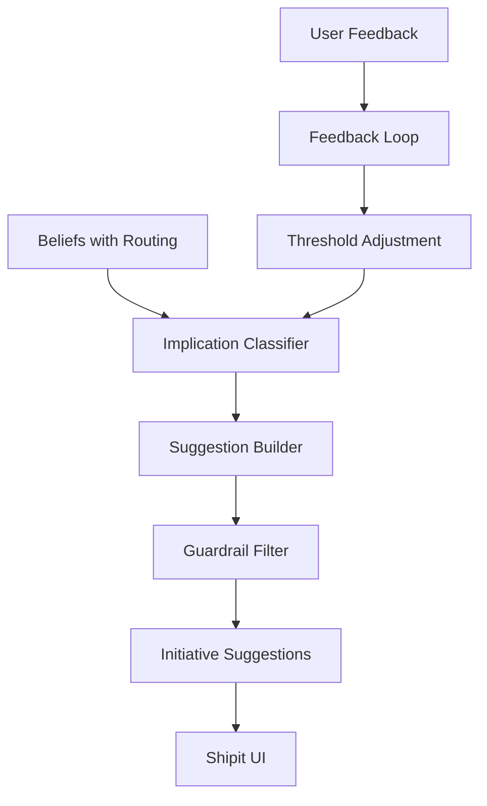

# Belief-to-Initiative Suggestion Conversion

This module converts execution-agnostic **beliefs** (from meeting notes) into **initiative-level suggestions** for Shipit.

## Overview

The system takes beliefs extracted by the belief pipeline and converts them into actionable suggestions that can be applied to initiatives. There are exactly two suggestion types:

1. **`comment`** - Add a comment/note to an initiative
2. **`mutate_release_date`** - Propose a change to an initiative's release date

## Architecture

```
Meeting Notes
     ↓
Belief Pipeline (belief-pipeline/)
     ↓
Beliefs (execution-agnostic)
     ↓
[THIS MODULE]
     ↓
Initiative Suggestions
     ↓
Shipit UI
```

### Pipeline Stages



## Core Components

### 1. Implication Classifier (`implicationClassifier.ts`)

Determines what kind of action a belief implies:

- **`pure_commentary`** - Status, decisions, risks, scope (no timeline change)
- **`timeline_risk`** - Current date unlikely/impossible
- **`timeline_pull_in`** - Can ship earlier
- **`timeline_uncertain`** - Vague or conflicting timing

Also extracts:
- `has_concrete_date` - Whether we can derive a specific date
- `estimated_delta_days` - Number of days to push/pull

### 2. Suggestion Builder (`suggestionBuilder.ts`)

Converts beliefs + implications into concrete suggestions:

#### Comment Suggestions

Created for:
- Pure commentary (always)
- Timeline implications (as narrative, even if date change also created)

Status:
- `suggested` - Strong initiative mapping, clear content
- `needs_clarification` - Ambiguous initiative, vague belief, or missing data

#### Release Date Mutation Suggestions

Created for:
- `timeline_risk` or `timeline_pull_in` implications
- Belief must reference a current or target date

Status:
- `suggested` - Strong mapping, concrete proposed date, reasonable delta
- `needs_clarification` - No concrete date derivable, very large delta (>90 days), or ambiguous initiative

### 3. Guardrail Filter (`guardrailFilter.ts`)

Applies anti-spam measures **without dropping suggestions**:

- **Clustering** - Groups similar beliefs by initiative, dimension, and topic
- **Deduplication** - Merges similar suggestions across meetings
- **Soft Caps** - Limits per initiative per meeting:
  - Up to 3 `comment` suggestions
  - Up to 1 `mutate_release_date` suggestion
- **Overflow Handling** - Aggregates excess into existing suggestions or downgrades to `needs_clarification`
- **Priority Scoring** - Ranks by impact, confidence, recency, novelty

### 4. Feedback Loop (`feedbackLoop.ts`)

Learns from user actions to refine the system:

- **Captures** - Accepts, dismissals, edits
- **Analyzes** - Acceptance rates, dismiss reasons, time to action
- **Recommends** - Threshold adjustments based on patterns
- **Learns** - Spam indicators, quality signals

## Key Design Principles

### 1. Never Drop Due to "Insufficient Structure"

**Always materialize something** for each non-trivial belief:
- If uncertain → `needs_clarification`
- If low priority → lower `priority_score` (rank lower, don't drop)
- If ambiguous initiative → `needs_clarification` with no target

### 2. Evidence Preservation

Evidence spans from beliefs are **always** preserved:
- Stored as `EvidenceSpanRef[]` in suggestions
- Displayed in UI with:
  - Meeting name, speaker, timestamp
  - Snippet of text
  - Deep-link to note at exact character offset

### 3. Belief-Initiative Mapping

Mapping strength determines status:

| Scenario | Status |
|----------|--------|
| `subject_initiative_id` provided | `suggested` |
| Top match score ≥ 0.7, gap ≥ 0.2 | `suggested` |
| Top match score ∈ [0.4, 0.7) | `needs_clarification` |
| Top match score < 0.4 | `needs_clarification` |
| Multiple similar scores | `needs_clarification` |

### 4. Anti-Spam Without Suppression

- Spam scoring for ranking (not dropping)
- Soft caps with overflow aggregation
- Cross-meeting dedup by merging evidence
- User dismissals train future spam detection

## Usage

### Basic Example

```typescript
import { executeBeliefToSuggestionPipeline } from '@/lib/belief-to-initiative';

// Beliefs from belief pipeline
const beliefs: BeliefWithRouting[] = [...];

// Existing suggestions (for dedup)
const existingSuggestions: InitiativeSuggestion[] = [...];

// Convert
const result = executeBeliefToSuggestionPipeline(
  beliefs,
  existingSuggestions
);

// result.suggestions contains InitiativeSuggestion[]
```

### With Custom Config

```typescript
const config = {
  thresholds: {
    min_initiative_match_score: 0.75, // Stricter matching
    max_comment_suggestions_per_initiative_per_meeting: 2, // Lower cap
  },
  enable_clustering: true,
  enable_cross_meeting_dedup: true,
};

const result = executeBeliefToSuggestionPipeline(
  beliefs,
  existingSuggestions,
  config
);
```

### Recording Feedback

```typescript
import { storeFeedbackEvent } from '@/lib/belief-to-initiative/feedbackLoop';

// User accepted a suggestion
await storeFeedbackEvent({
  suggestion_id: 's123',
  action: 'accepted',
  timestamp: new Date().toISOString(),
  user_id: 'user_456',
  time_to_action_seconds: 45,
});

// User dismissed as spam
await storeFeedbackEvent({
  suggestion_id: 's124',
  action: 'dismissed',
  timestamp: new Date().toISOString(),
  user_id: 'user_456',
  dismiss_reason: 'spam',
  time_to_action_seconds: 10,
});
```

### Analyzing Feedback

```typescript
import {
  computeFeedbackStats,
  recommendThresholdAdjustments,
  applyThresholdAdjustments,
} from '@/lib/belief-to-initiative/feedbackLoop';

// Get feedback events and suggestions
const events = await retrieveFeedbackEvents({ start_date: '2026-01-01' });
const suggestions = [...]; // from DB

// Compute stats
const stats = computeFeedbackStats(events, suggestions);
console.log(`Acceptance rate: ${stats.acceptance_rate}`);

// Get recommendations
const adjustments = recommendThresholdAdjustments(stats, currentThresholds);

// Apply high-confidence adjustments
const newThresholds = applyThresholdAdjustments(
  currentThresholds,
  adjustments,
  0.7 // min confidence
);
```

## UI Integration

### Evidence Spans Component

```tsx
import { EvidenceSpans } from '@/components/inbox/EvidenceSpans';

<EvidenceSpans 
  spans={suggestion.evidence_spans}
  defaultOpen={false}
/>
```

Features:
- Collapsible evidence list
- Grouped by meeting/note
- Shows speaker, timestamp
- Deep-links to exact note location
- Inline snippets

### Evidence Badge (inline)

```tsx
import { EvidenceBadge } from '@/components/inbox/EvidenceSpans';

<EvidenceBadge 
  count={suggestion.evidence_spans.length}
  onClick={() => setShowEvidence(true)}
/>
```

## Configuration

### Thresholds

See `types.ts` for `SuggestionThresholds` interface. Key parameters:

- **Initiative Mapping**
  - `min_initiative_match_score`: 0.7 (strong match required)
  - `min_match_gap`: 0.2 (gap to next candidate)
  - `ambiguous_match_threshold`: 0.4 (below = too weak)

- **Confidence**
  - `min_belief_confidence`: 0.6

- **Timeline Mutations**
  - `max_delta_days`: 90 (beyond = needs clarification)

- **Spam Control**
  - `max_comment_suggestions_per_initiative_per_meeting`: 3
  - `max_release_date_suggestions_per_initiative_per_meeting`: 1

- **Clustering**
  - `embedding_similarity_threshold`: 0.85 (for dedup)

## Examples

### Example 1: Clear Schedule Slip

**Belief:**
```json
{
  "summary": "We won't make March 1; realistically we're looking at mid-March.",
  "dimension": "timeline",
  "subject_initiative_id": "init_123",
  "confidence_score": 0.8,
  "timeline_signal": {
    "current_release_date": "2026-03-01",
    "mentioned_date": "2026-03-15",
    "suggested_delta_days": 14
  }
}
```

**Suggestions:**
1. **`mutate_release_date`** (status: `suggested`)
   - Current: 2026-03-01
   - Proposed: 2026-03-15
   - Direction: push_back
   - Rationale: "Team believes this will slip ~2 weeks..."

2. **`comment`** (status: `suggested`)
   - Body: "Timeline risk: We won't make March 1; realistically..."

### Example 2: Ambiguous Initiative

**Belief:**
```json
{
  "summary": "The new auth flow might impact checkout and account pages.",
  "dimension": "risk",
  "confidence_score": 0.8,
  "initiative_match_scores": {
    "init_123": 0.55,
    "init_456": 0.52
  }
}
```

**Suggestion:**
1. **`comment`** (status: `needs_clarification`)
   - Target: null (unscoped)
   - Body: "This belief...unclear which initiative. Please attach or dismiss."

### Example 3: Qualitative Risk (No Date)

**Belief:**
```json
{
  "summary": "It's very unlikely we'll hit March 1, but we haven't re-estimated yet.",
  "dimension": "timeline",
  "subject_initiative_id": "init_123",
  "timeline_signal": {
    "current_release_date": "2026-03-01",
    "mentioned_date": null,
    "suggested_delta_days": null,
    "likelihood_meeting_current_date": 0.3
  }
}
```

**Suggestion:**
1. **`mutate_release_date`** (status: `needs_clarification`)
   - Current: 2026-03-01
   - Proposed: null
   - Rationale: "Beliefs indicate March 1 is unlikely. Please confirm new date."

## Testing

```bash
npm test src/lib/belief-to-initiative
```

Tests cover:
- Implication classification for all kinds
- Suggestion building with various belief configurations
- Status determination (suggested vs needs_clarification)
- Guardrail filtering and rate limits
- Feedback stats computation
- Threshold adjustment recommendations

## Future Enhancements

1. **ML-based initiative matching** - Replace simple text matching with embeddings
2. **Conflict detection** - Flag conflicting timeline suggestions
3. **Batch operations** - "Apply all high-confidence suggestions"
4. **Natural language rationales** - LLM-generated explanations
5. **Initiative creation hints** - Auto-suggest new initiative when no good match
